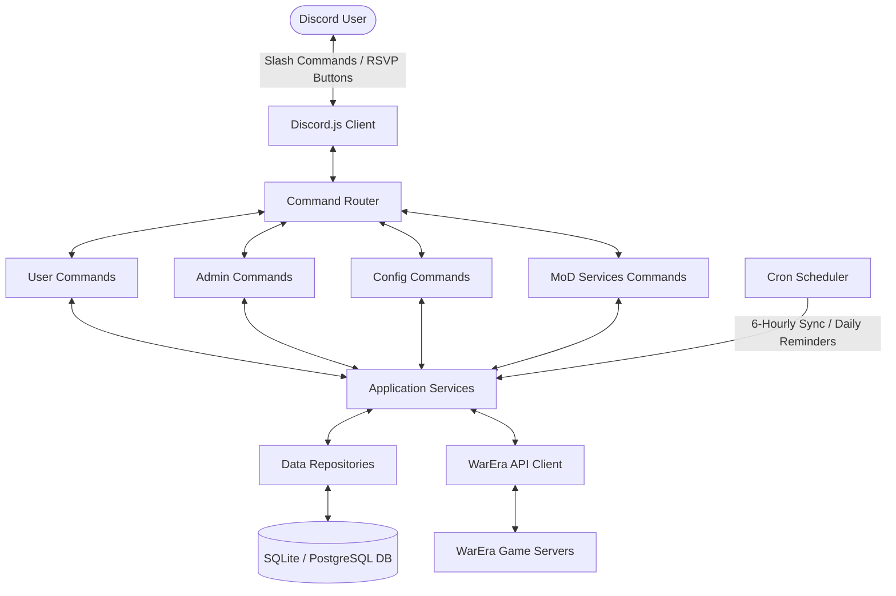
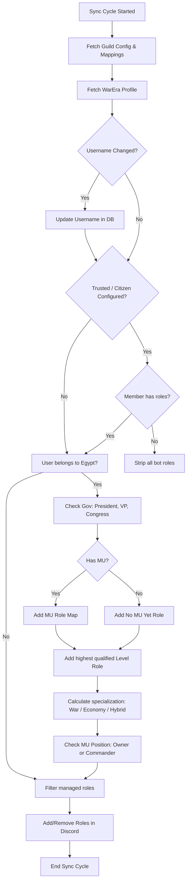

# Egypt Discord Bot for WarEra - Project Documentation

Welcome to the **WarEra Egypt Discord Bot** handoff documentation. This document is designed for developers, systems administrators, or AI systems who need to understand, maintain, deploy, or extend this application without reading the entire source code first.

---

## 1. Project Overview

### What the Bot Does
The WarEra Egypt Discord Bot is a specialized automation tool that links Discord guilds (servers) with the tRPC-based public API of the strategy game **WarEra**. It performs automated role management, tracks player specifications (War, Economy, Hybrid), and runs a military mobilization and alerts dashboard for country cabinets (presidents, vice presidents, congress, and Ministry of Defense officers).

### Main Purpose
- **Identity Verification**: Maps Discord accounts to in-game WarEra usernames securely and disambiguates multiple search matches.
- **Cabinet & Role Sync**: Automatically maps and assigns custom Discord roles to server members based on levels, specific Military Units (MUs), and government positions (President, Vice President, Congress).
- **MoD Mobilization Tools**: Assists the Ministry of Defense (MoD) in running recruitment campaigns to push high-level players into a combat-focused "War" build, dispatching direct operations notifications, collecting availability RSVPs, and compiling readiness dashboards.

### Target Users
1. **Egyptian Server Members**: Verified players seeking automatic role updates representing their in-game achievements.
2. **MoD Cabinet / MoD Officers**: Administrators tasked with coordinating military strikes, monitoring readiness metrics, and reminding citizens to adjust their build specializations.
3. **Guild Administrators**: Server managers who configure role mappings and trusted credentials.

### How WarEra Integration Works
The bot queries the game's read-only JSON-RPC/tRPC API endpoints. By serializing queries as GET URL arguments (e.g. `input={"0":{...}}` with `batch=1`) and attaching an authorization header containing a WarEra API key, the bot pulls live player statistics. The bot's role synchronization services query these profile properties and update Discord roles accordingly.

---

## 2. Architecture



### Folder Structure
```
c:/program1/python/
├── prisma/
│   ├── dev.db                    # SQLite local testing database
│   └── schema.prisma             # Database schema definition
├── src/
│   ├── index.ts                  # Application bootstrapper
│   ├── config/
│   │   └── index.ts              # Environmental config loader & validator
│   ├── database/
│   │   └── index.ts              # Database client initializer
│   ├── discord/
│   │   └── client.ts             # Discord client, events, and slash registrator
│   ├── warera/
│   │   ├── client.ts             # tRPC API HTTP requests driver
│   │   └── service.ts            # High-level in-game data mapping helper
│   ├── repositories/
│   │   ├── guildConfig.repository.ts
│   │   ├── levelRole.repository.ts
│   │   ├── muRole.repository.ts
│   │   └── userLink.repository.ts
│   ├── services/
│   │   ├── guildConfig.service.ts
│   │   ├── muRole.service.ts
│   │   ├── operation.service.ts  # Military alerts dispatcher & RSVP logger
│   │   ├── readiness.service.ts  # Stats compiler for MoD dashboard
│   │   ├── recruitment.service.ts# Campaign & exemption operations
│   │   ├── roleSync.service.ts   # Role validation, stripping, & sync engine
│   │   └── verification.service.ts# Verification flow & database linking
│   ├── commands/
│   │   ├── index.ts              # Aggregator & Interaction Router
│   │   ├── admin.commands.ts     # Command handlers for server admins
│   │   ├── config.commands.ts    # Command handlers for role configurations
│   │   ├── operation.commands.ts # MoD operations controls
│   │   ├── readiness.commands.ts # MoD readiness dashboard
│   │   ├── recruitment.commands.ts# MoD recruitment controls
│   │   └── user.commands.ts      # Profile, verification, and self-sync commands
│   ├── jobs/
│   │   ├── sync.job.ts           # 6-hourly role sync cron task
│   │   └── recruitmentReminder.job.ts # Daily recruitment DM reminder cron task
│   ├── types/
│   │   ├── Responses.d.ts        # In-game API response structure interfaces
│   │   └── warera-openapi.d.ts   # Auto-generated openapi path schemas
│   └── utils/
│       └── logger.ts             # Pino-based logger setup
├── .env                          # Local credentials file (ignored in git)
├── Dockerfile                    # Containerization script
└── tsconfig.json                 # Strict compiler configurations
```

### Prisma Schema Explanation
The database schema targets multi-tenant installations (supporting multiple Discord servers). In SQLite local testing, it writes to `dev.db`, while in production, it is fully compatible with PostgreSQL.

- **UserLink**: Tracks which Discord member is linked to which WarEra ID, cached username, daily reminder timestamps (`lastRecruitmentReminderAt`), and reminder exemption flag (`exemptFromRecruitment`).
- **GuildConfig**: Stores Discord server-specific roles including the cabinet roles, the newly added `officerRoleId` (for MoD Officer access), `trustedRoleId` (for verification/sync restrictions), and `muCommanderRoleId` / `muOwnerRoleId` (for leadership automations).
- **MuRole**: Stores mapping relationships between specific WarEra Military Unit IDs (strings) and Discord roles.
- **LevelRole**: Maps minimum level thresholds to designated Discord roles.
- **RecruitmentCampaign**: Tracks title, minimum level threshold, createdBy (discordId), active campaign status, and ended timestamp.
- **Operation**: Logs military alerts target groups (`war`, `economy`, `hybrid`, `level`, `mu`, `all`), text directives, author tags, and total notification count.
- **OperationResponse**: Logs user responses (✅ Available / ❌ Unavailable) linked to a specific operation ID with unique constraints on `(operationId, discordId)`.

---

## 3. Environment Variables

Environmental settings are declared in a local `.env` file at the root. The configuration parser ([src/config/index.ts](file:///c:/program1/python/src/config/index.ts)) parses and asserts strict types for all fields on boot:

| Name | Type | Description | Example |
| :--- | :--- | :--- | :--- |
| `DISCORD_TOKEN` | String | Private Discord API token for the bot client. | `MTUxNjQwNTI...` |
| `DISCORD_CLIENT_ID`| String | Application ID of the Discord bot client. | `1516405265992519762` |
| `DATABASE_URL` | String | Connection string. For SQLite testing: `file:./dev.db`. | `file:./dev.db` |
| `WARERA_API_KEY` | String | Private API authorization key for game servers access. | `wae_fc85c61416...` |
| `WARERA_API_BASE_URL`| String | Base URL of the WarEra game servers tRPC router. | `https://api2.warera.io/trpc/` |
| `NODE_ENV` | String | Environment switch: `development` / `production`. | `development` |
| `LOG_LEVEL` | String | Standard logging output level (`debug`, `info`, `warn`, `error`).| `info` |

---

## 4. Database Models

Here is a detailed specification of all tables generated by Prisma:

### `UserLink`
Maps Discord accounts to verified WarEra profiles.
* **Fields**:
  - `id`: `String` (UUID primary key).
  - `discordId`: `String` (Unique). Discord snowflake ID.
  - `wareraUserId`: `String` (Unique). In-game profile ID.
  - `wareraUsername`: `String`. Cached in-game username.
  - `verifiedAt`: `DateTime`. Date verification completed (updated on sync).
  - `createdAt`: `DateTime`. Row creation timestamp.
  - `updatedAt`: `DateTime` (Automatic). Updated when roles are successfully synchronized (acts as **Last Sync Time**).
  - `lastRecruitmentReminderAt`: `DateTime?`. Prevents spamming mobilization DMs (restricted to once per 24 hours).
  - `exemptFromRecruitment`: `Boolean` (Default `false`). Flag to bypass MoD recruitment alerts.

### `GuildConfig`
Stores bot configuration details for each Discord server.
* **Fields**:
  - `id`: `String` (UUID primary key).
  - `guildId`: `String` (Unique). Discord server snowflake.
  - `citizenRoleId`: `String?`. Role for Egyptian citizens (managed manually by server staff, used as verification/trust check).
  - `presidentRoleId`: `String?`. Role for the in-game President of Egypt.
  - `vicePresidentRoleId`: `String?`. Role for the in-game Vice President.
  - `congressRoleId`: `String?`. Role for current congress members.
  - `warRoleId`: `String?`. Role for War specialization.
  - `economyRoleId`: `String?`. Role for Economy specialization.
  - `hybridRoleId`: `String?`. Role for Hybrid specialization.
  - `officerRoleId`: `String?`. Role required to run `/recruitment` and `/operation` commands (MoD officers).
  - `trustedRoleId`: `String?`. Role required to sync roles and participate in MoD operations.
  - `muCommanderRoleId`: `String?`. Role assigned to MU commanders.
  - `muOwnerRoleId`: `String?`. Role assigned to MU owners / founders.
  - `noMuRoleId`: `String?`. Role assigned if player is not in any MU ("No MU Yet" role).
  - `partyId`: `String?`. The WarEra Political Party ID this Discord guild represents. WarEra remains the source of truth for membership/position — this is the only party-related fact actually stored.
  - `partyPresidentRoleId`: `String?`. Role assigned to the configured party's leader.
  - `partyTreasurerRoleId`: `String?`. Role assigned to the configured party's treasurer.
  - `partyCouncilRoleId`: `String?`. Role assigned to the configured party's council members.
  - `partyMemberRoleId`: `String?`. Role assigned to any member of the configured party (in addition to president/treasurer/council roles above).
  - `updatedAt`: `DateTime` (Automatic).

### `MuRole`
Maps WarEra Military Units to Discord Roles.
* **Fields**:
  - `id`: `String` (UUID primary key).
  - `guildId`: `String`. Discord server snowflake.
  - `muId`: `String`. In-game MU ID.
  - `muName`: `String`. Cached MU name.
  - `discordRoleId`: `String`. Discord role to assign.
  - `createdAt` & `updatedAt`: `DateTime`.
* **Index**: Unique constraint on `[guildId, muId]`.

### `LevelRole`
Maps level thresholds to Discord Roles.
* **Fields**:
  - `id`: `String` (UUID primary key).
  - `guildId`: `String`. Discord server snowflake.
  - `minimumLevel`: `Int`. Level required to qualify.
  - `discordRoleId`: `String`. Discord role to assign.
  - `createdAt` & `updatedAt`: `DateTime`.
* **Index**: Unique constraint on `[guildId, minimumLevel]`.

### `RecruitmentCampaign`
Tracks MoD recruitment campaigns.
* **Fields**:
  - `id`: `String` (UUID primary key).
  - `guildId`: `String`. Discord server snowflake.
  - `title`: `String`. Directive title.
  - `minimumLevel`: `Int`. Minimum level required to be eligible.
  - `active`: `Boolean` (Default `true`). Campaign status.
  - `createdBy`: `String`. Discord user ID of the officer who created it.
  - `createdAt` & `endedAt`: `DateTime?`.

### `Operation`
Tracks dispatched military operations.
* **Fields**:
  - `id`: `String` (UUID primary key).
  - `guildId`: `String`.
  - `title`: `String`. Operation title.
  - `message`: `String`. Operations objective message.
  - `targetType`: `String`. Target filters (`war`, `economy`, `hybrid`, `level`, `mu`, `all`).
  - `targetMuId`: `String?`. MU ID if targeting an MU.
  - `targetLevel`: `Int?`. Level if targeting a level threshold.
  - `createdBy`: `String`. Discord ID of the officer who launched it.
  - `createdAt`: `DateTime`.
  - `sentToCount`: `Int`. Number of successfully sent DMs.
  - `responses`: Relation to `OperationResponse` records (Cascade delete enabled).

### `OperationResponse`
Logs RSVP responses from players.
* **Fields**:
  - `id`: `String` (UUID primary key).
  - `operationId`: `String`. Linked operation record.
  - `discordId`: `String`. Member who responded.
  - `response`: `String`. Response choice (`available` or `unavailable`).
  - `createdAt`: `DateTime`.
* **Index**: Unique constraint on `[operationId, discordId]`.

---

## 5. Discord Commands

All commands are slash commands. Permissions are restricted using Discord permissions (`default_member_permissions`).

### User Commands

#### `/verify <username>`
Links a user's Discord ID to their in-game WarEra account.
- **Parameters**: `username` (String, required).
- **Execution Flow**:
  1. Searches the API for the username.
  2. If multiple matches exist, it displays a dropdown select menu.
  3. Saves connection to `UserLink` table.
  4. Runs an immediate role synchronization.

#### `/profile [member] [username]`
Displays a player card with identity, stats, rankings, and Discord info.
- **Parameters**: 
  - `member` (User, optional): View another Discord member's profile.
  - `username` (String, optional): Search directly by WarEra username (shows select menu if multiple matches).
- **Behavior**:
  - Automatically hides empty fields.
  - Displays linked status, Discord info, and bot roles.

#### `/sync-me`
Forces an immediate update of the requesting user's own roles.
- **Output**: Confirmation message listing changes.

---

### Admin Commands
*(Requires Administrator permission)*

#### `/forceverify <user> <username>`
Links a member's Discord account to a WarEra profile.
- **Parameters**: `user` (User, required), `username` (String, required).
- **Behavior**: Automatically runs role sync on success.

#### `/unverify <user>`
Unlinks a Discord account and strips all bot-managed roles.
- **Parameters**: `user` (User, required).

#### `/sync <user>`
Manually triggers role synchronization for a specific user.
- **Parameters**: `user` (User, required).

#### `/sync-all`
Synchronizes roles for all linked users in the guild.
- **Output**: Embed showing success/failure tallies.

---

### Config Commands
*(Requires Administrator permission)*

#### `/config <subcommand> <role>`
Sets configuration roles for the guild.
- **Subcommands**:
  - `citizen-role` (Used as trust/verification check; manually managed by server staff)
  - `officer-role` (Required to use MoD commands)
  - `president-role`
  - `vice-president-role`
  - `congress-role`
  - `war-role`
  - `economy-role`
  - `hybrid-role`
  - `trusted-role` (Required to sync roles or participate in MoD)
  - `mu-commander-role`
  - `mu-owner-role`
  - `no-mu-role` (Required if player has no Military Unit yet)
  - `party-president-role`
  - `party-treasurer-role`
  - `party-council-role`
  - `party-member-role` (Also granted to president/treasurer/council)

#### `/config party-id <party-id>`
Sets the **WarEra Political Party ID** this guild represents (a `String`, not a Role — this is the one `/config` subcommand that doesn't take a `role` option). See [§16 Political Party System](#16-political-party-system) below.

#### `/mu-role add <mu-id> <role>` / `/mu-role remove <mu-id>` / `/mu-role list`
Manages Military Unit role assignments.

#### `/level-role add <level> <role>` / `/level-role remove <level>` / `/level-role list`
Manages minimum level role configurations.

---

### MoD Cabinet Commands
*(Requires Administrator or MoD Officer Role)*

#### `/recruitment start <title> <minimum-level>`
Deactivates active campaigns and starts a new one.

#### `/recruitment stop`
Stops the currently active campaign.

#### `/recruitment status`
Shows overall stats (eligible vs converted counts) for the active campaign.

#### `/recruitment report`
Provides a detailed conversion report grouped by Military Unit.

#### `/recruitment exempt <user>` / `/recruitment unexempt <user>`
Manages reminder exclusions for a user.

#### `/operation create <title> <message> <target-type> [mu-id] [minimum-level]`
Dispatches direct message alerts to matching players. Target choices are `war`, `economy`, `hybrid`, `level`, `mu`, and `all`.

#### `/operation list`
Lists the last 15 logged operations.

#### `/operation status <operation-id>`
Queries RSVP results (Available, Unavailable, No Response).

#### `/readiness`
Displays military statistics (Personnel breakdown, levels, campaign conversions, and operations response rates).

---

## 6. Role Synchronization System

Role sync updates roles based on in-game data during sync cycles:



### A. Trusted Role & Citizen Role Validation
- **Citizen Role (`citizenRoleId`)**: Managed manually by server staff. The bot **never** assigns or removes the Citizen role.
- **Trusted Role (`trustedRoleId`)**: Managed manually by server staff.
- **Verification Rule**: 
  - If `citizenRoleId` is configured and the member lacks it, they fail the trust check (`isTrusted = false`).
  - If `trustedRoleId` is configured and the member lacks it, they fail the trust check (`isTrusted = false`).
  - If they fail the trust check: role sync immediately strips all bot-managed roles. No roles are assigned.

### B. Specialization Calculation
Computes skill points to determine specialization:
- **War Score**: Sum of Attack, Precision, Critical Chance, Critical Damage, Armor, Dodge, and Loot Chance.
- **Economy Score**: Sum of Production, Management, Entrepreneurship, and Companies.
- **Rule**:
  - `War Specialist` if `War Score >= Economy Score * 1.5`
  - `Economy Specialist` if `Economy Score >= War Score * 1.5`
  - `Hybrid Specialist` otherwise.

### C. MU Leadership & No MU Yet Assignment
- **No MU Yet Role (`noMuRoleId`)**: If the player has no Military Unit (`!profile.mu`) and `isTrusted` is `true`:
  - Assign the configured `No MU Yet` role.
  - Strip/do not assign any MU mappings, MU Commander, or MU Owner roles.
- **MU Membership**: If the player joins an MU:
  - Remove the `No MU Yet` role.
  - Assign the appropriate mapped MU role.
- **Commander**: Assigned if player is in the `roles.commanders` array of the MU response.
- **Owner**: Assigned if player ID matches the `user` owner ID of the MU response.

### D. Political Party Role Sync (added)
Runs in the same `isTrusted` branch as the blocks above, right after the recruitment-completion check, as one more first-class managed-role block feeding the same `targetRoleIds`/`managedRoleIds` sets:

1. Skip entirely if this guild hasn't configured both a `partyId` (`/config party-id`) and at least one party role.
2. Otherwise call `wareraService.getParty(config.partyId)` (endpoint: `party.getById`, 60s in-memory cache).
   - **On success**: the four party role IDs join `managedRoleIds` for this cycle, then `determinePartyPosition()` checks, in order: is the player `party.leader`? is the player `party.treasurer`? is the player in `party.councilMembers`? is the player in `party.members`? → `'president' | 'treasurer' | 'council' | 'member' | 'none'`. `resolvePartyTargetRoleIds()` then maps that to the actual configured role ID(s) — President/Treasurer/Council positions always add the Member role ID as well; `'none'` adds nothing (so any previously-held party roles fall out on the removal diff).
   - **On failure** (network error, timeout, WarEra outage): the party role IDs are **not** added to `managedRoleIds` this cycle at all, so the add/remove diff can't touch them — whatever party roles the member currently has are left exactly as they were. This is logged as `Party sync: WarEra Party API unavailable this cycle...` and is intentionally different from the `'none'` case above (a confirmed non-member), per the requirement that a failed request must never be treated as "not in the party."
3. `determinePartyPosition()` / `resolvePartyTargetRoleIds()` are pure exported functions in `roleSync.service.ts` (no Discord.js/Prisma dependency), used identically by `/profile`'s party display and covered by `verify_party_sync.ts`.
- **Owner Override**: If the player is Owner, they are assigned the Owner role, and the Commander role is removed/ignored.

---

## 7. Recruitment System

Helps move Egyptian citizens to the War build.
- **Campaigns**: Only one campaign can be active at a time.
- **Exemptions**: Exempt users are bypassed during reminders and omitted from stats.
- **Daily Reminders**: Evaluates non-exempt, trusted users who have the Citizen role (if configured) and haven't been reminded in the last 23 hours. Sent daily at 12:00 PM.
- **Automatic Completion**: If a user switches to a War build, the sync engine detects it, sends a congratulations DM, and stops further reminders.

---

## 8. Military Operations System

Dispatches direct notifications to members for military operations.
- **Target Types**: `war`, `economy`, `hybrid`, `level`, `mu`, and `all`.
- **Inclusion Filters**: Restricts dispatching to verified, trusted players in the Egypt country code who hold the Citizen role (if configured).
- **DM Batching**: Bot sends messages with a **250ms batching delay** (4 messages/sec max) to prevent Discord rate limit bans.
- **Availability Response**: Interactive buttons (Success green "Available", Danger red "Unavailable") let users RSVP.

---

## 9. Readiness System

Compiles readiness metrics:
- **Active Military (War Specialists)**: Active combat players.
- **Level Brackets**: Tally of Level 50+ and Level 100+ players who hold the Citizen role and Trusted role (if configured).
- **Campaign Progress**: Conversion rate metrics.
- **Avg RSVP Response Rate**: Average response rate across all operations.

---

## 10. WarEra API Integration

Queries the game's public API endpoints using HTTP POST:

| Endpoint | Target Method | Parameters | Dependencies |
| :--- | :--- | :--- | :--- |
| `user.getUserLite` | `post` | `{ userId }` | Profile stats, Level sync, Specialization mapping. |
| `search.searchAnything` | `post` | `{ searchText }` | Resolving usernames in `/verify` and `/profile`. |
| `country.getAllCountries` | `post` | `{}` | Checking country citizenship. |
| `government.getByCountryId` | `post` | `{ countryId }` | Cabinet role synchronization. |
| `mu.getById` | `post` | `{ muId }` | MU membership and MU leadership mapping. |
| `party.getById` | `post` | `{ partyId }` | Political Party role sync (`leader`/`treasurer`/`councilMembers`/`members` fields) and `/profile` party display. **Not directly live-tested against `api2.warera.io`** during development (sandboxed environment had no network route to it) — verified against the community WarEraProjects API client docs instead. Confirm with a real `/config party-id` + `/sync-me` before relying on it in production. |

---

## 11. Security Model

- **Trusted Role & Citizen Role Protection**: Restricts syncing and MoD features to trusted members holding manually assigned roles.
- **Verification Limitations**: Because the API is read-only, ownership is verified by matching the username. Server admins can resolve conflicts or manually verify users with `/forceverify`.
- **Anti-Impersonation**: If a user attempts to verify a username that is already linked to another Discord ID, the bot blocks the link to prevent hijacking.

---

## 12. Scheduled Jobs

Runs scheduled cron tasks:
1. **Role Synchronization**: Runs every 6 hours (`0 */6 * * *` at `00:00`, `06:00`, `12:00`, `18:00`).
2. **Recruitment Reminder**: Runs daily at 12:00 PM (`0 12 * * *`).

---

## 13. Future Improvements

Recommended features for developers:
1. **Verification Code System**: Have users set their in-game bio to a temporary code to confirm ownership.
2. **Auto-Officer Registration**: Automatically assign MoD officer roles to in-game Ministers of Defense.
3. **Equipment Tracking**: Include equipped weapon/armor stats on the profile card.
4. **Log Retention Cleaner**: Prune old operational logs to maintain database size.

---

## 14. Deployment Guide

### Installation
Ensure Node.js v22+ is installed:
```powershell
npm install
```

### Database Migration
Configure `DATABASE_URL` in `.env`, then run:
```powershell
# For SQLite testing
npx prisma db push

# For PostgreSQL production
npx prisma migrate deploy
```

### Running the App
```powershell
# Development
npm run dev

# Production Build & Start
npm run build
npm run start
```

### Data Backup
Back up the `dev.db` SQLite file before updating:
```powershell
copy prisma\dev.db prisma\dev.db.bak
```

---

## 15. Troubleshooting

- **Error: `Unauthorized (tRPC)`**: Ensure `WARERA_API_KEY` is correct.
- **Error: `Missing Permissions`**: Move the bot's Discord role above managed roles in server settings.
- **No DMs Sent**: Verify members have "Allow direct messages from server members" enabled.
